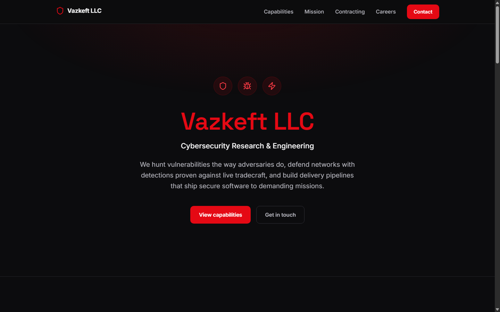
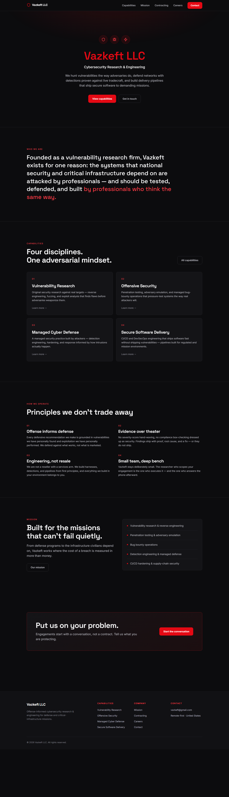
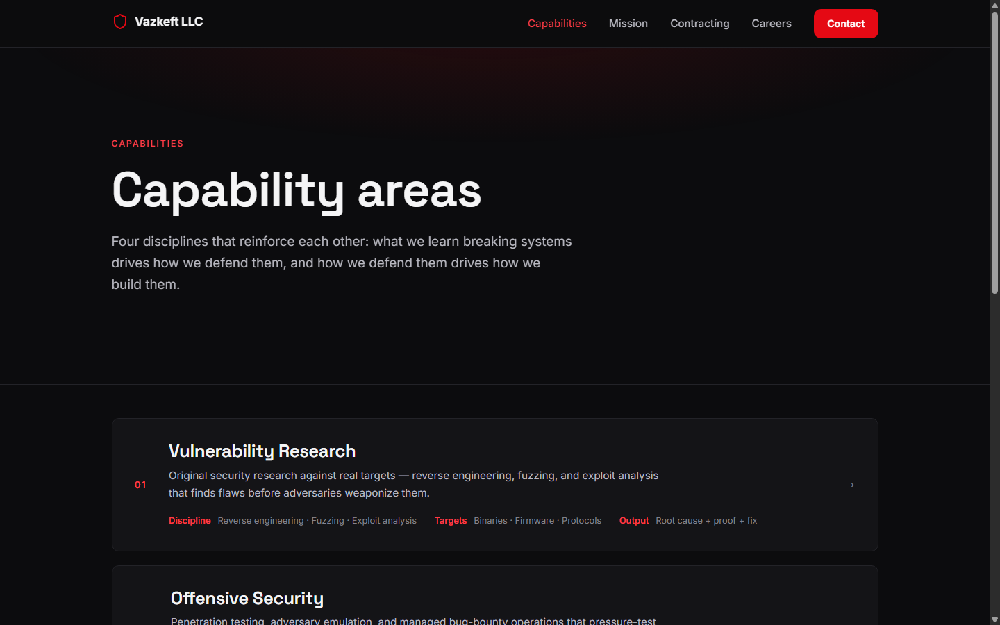
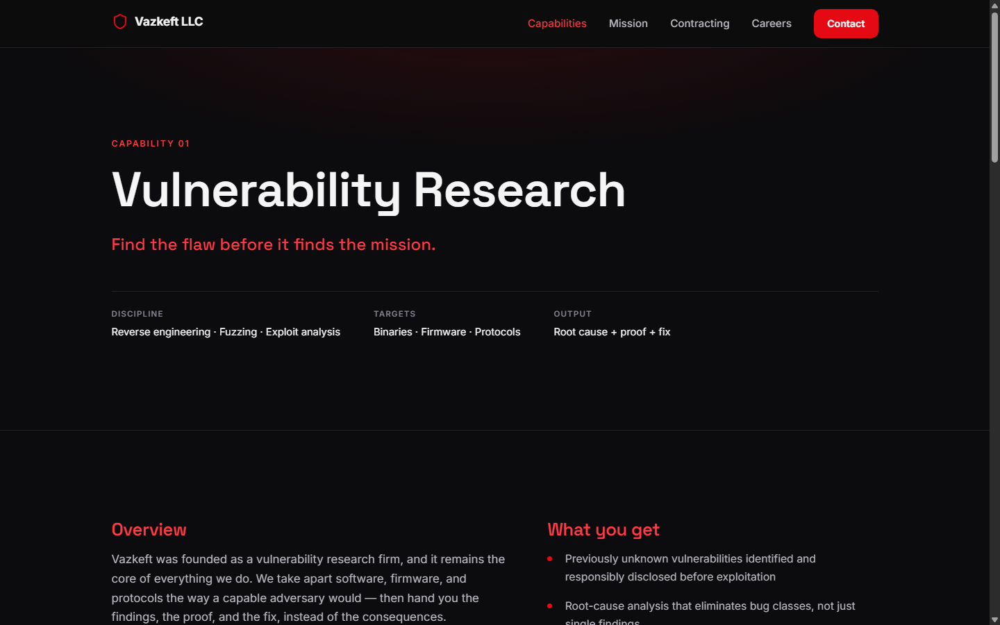
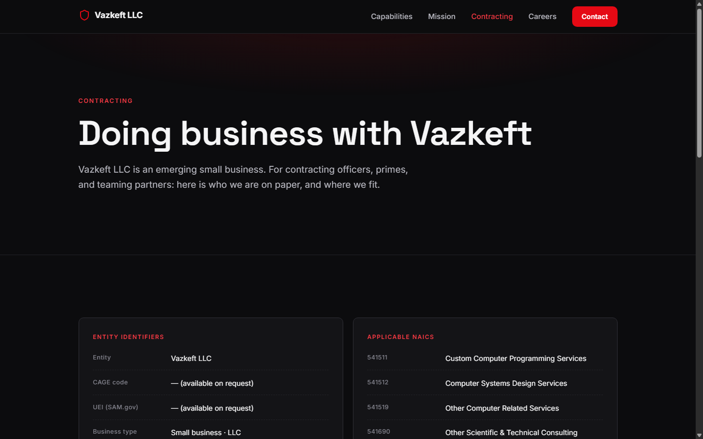
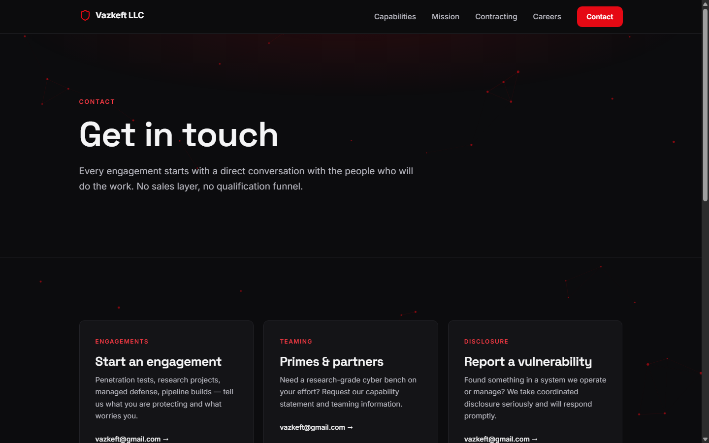
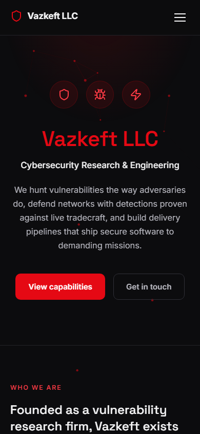

# Vazkeft LLC — Company Website

Static marketing site for Vazkeft LLC, a cybersecurity research & engineering firm
serving defense and critical-infrastructure missions. Replaces the previous
one-page site at https://vazkeft.com.



## Screenshots

| Home (full page) | Capability hub |
| --- | --- |
|  |  |

| Capability deep-dive | Contracting |
| --- | --- |
|  |  |

| Contact | Mobile |
| --- | --- |
|  |  |

## Stack

- [Astro 7](https://astro.build) — fully static output, zero client frameworks
- Fonts (self-hosted via Fontsource): Space Grotesk (display), Inter (body/UI)
- Vanilla JS only: red constellation background canvas, scroll reveals

## Structure

```
src/
  data/capabilities.ts        # single source of truth for the 4 capability areas
  layouts/BaseLayout.astro    # head, fonts, header/footer, reveal + constellation scripts
  components/                 # Logo, Header, Footer
  pages/
    index.astro               # home (hero, capabilities, principles, CTA)
    capabilities/index.astro  # capability hub
    capabilities/[slug].astro # deep-dive pages generated from data/capabilities.ts
    mission.astro  contracting.astro  careers.astro  contact.astro  404.astro
```

## Commands

| Command           | Action                              |
| ----------------- | ----------------------------------- |
| `npm install`     | Install dependencies                |
| `npm run dev`     | Dev server at `localhost:4321`      |
| `npm run build`   | Production build to `./dist/`       |
| `npm run preview` | Preview the production build        |

## Before launch — content checklist

- [ ] `src/pages/contracting.astro`: replace CAGE / UEI placeholders with real
      identifiers once issued (currently "available on request" — do **not**
      publish unissued numbers)
- [ ] Confirm NAICS registrations match the codes listed
- [ ] Decide whether to move contact from `vazkeft@gmail.com` to a
      `@vazkeft.com` mailbox (site-wide find/replace)
- [ ] Add real roles to `openRoles` in `careers.astro` when hiring
- [x] Hosting: Cloudflare Pages (`vazkeft-website` project, auto-deploys from
      `main`); vazkeft.com goes live when the Porkbun nameservers move to
      Cloudflare
